# Art3Hub V5 Architecture - Base-Only with Enhanced On-Chain Data Storage

## 🎯 System Overview

Art3Hub V5 introduces a revolutionary architecture focused on **Base blockchain deployment** with **comprehensive on-chain data storage**, eliminating traditional database dependencies while providing enhanced creator and collector experiences.

## 🏗️ High-Level Architecture

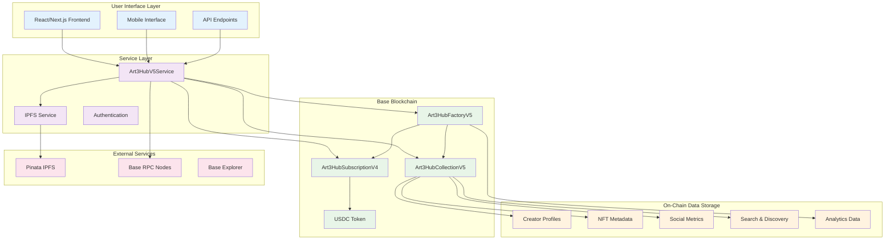

## 🔵 Base-Only Network Architecture

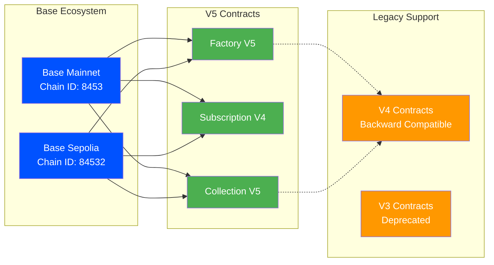

## 📊 Data Architecture Evolution

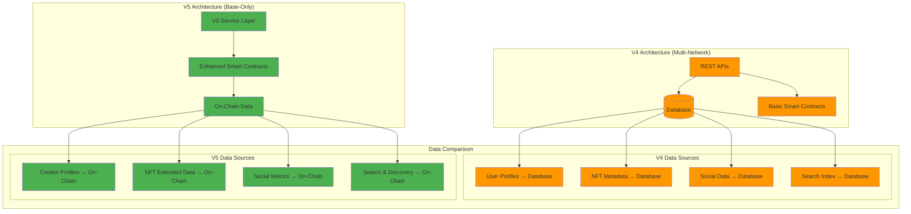

## 🎨 Smart Contract Architecture

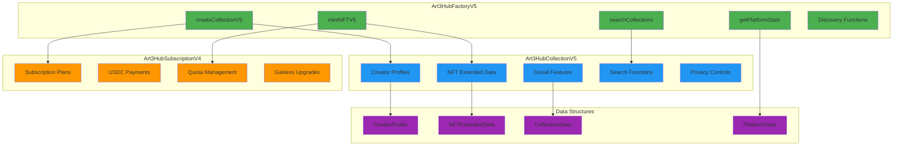

## 🔍 Enhanced Data Model

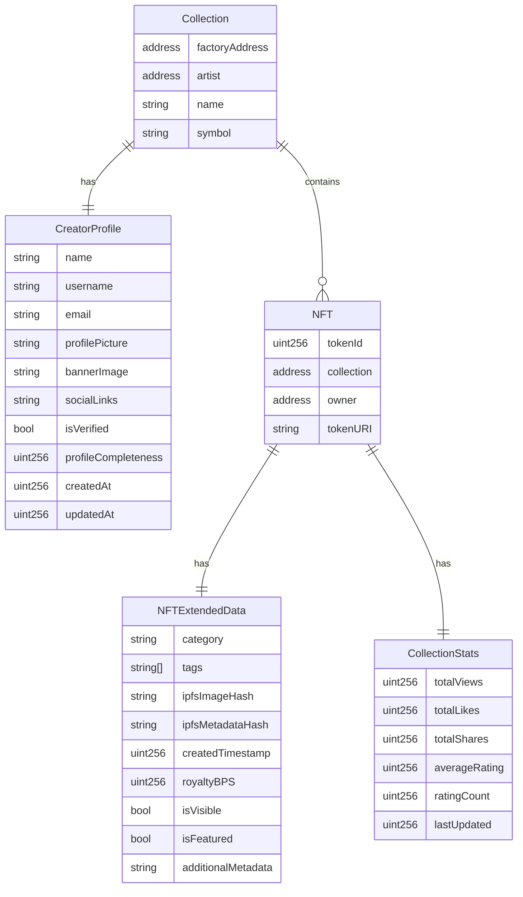

## 🔄 Service Layer Architecture

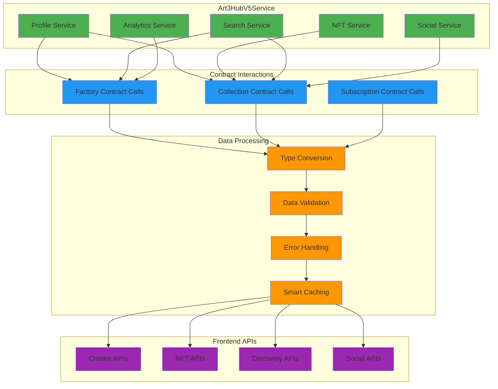

## 🎯 User Journey Flow

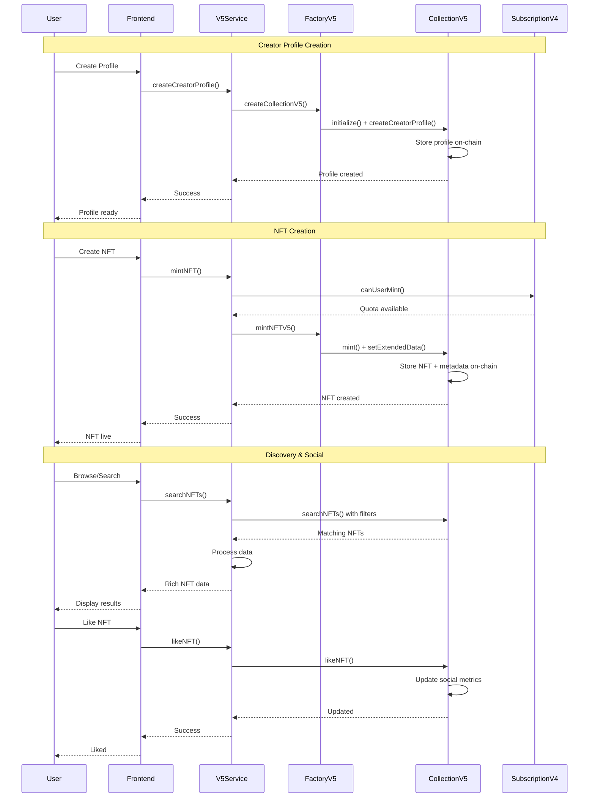

## 🔧 Frontend Architecture

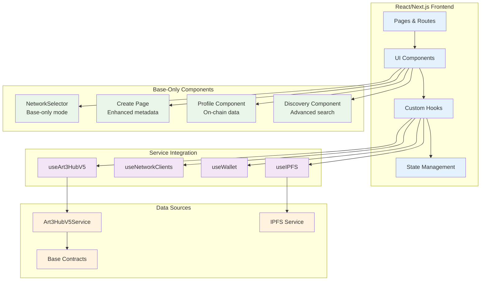

## 🚀 Deployment Architecture

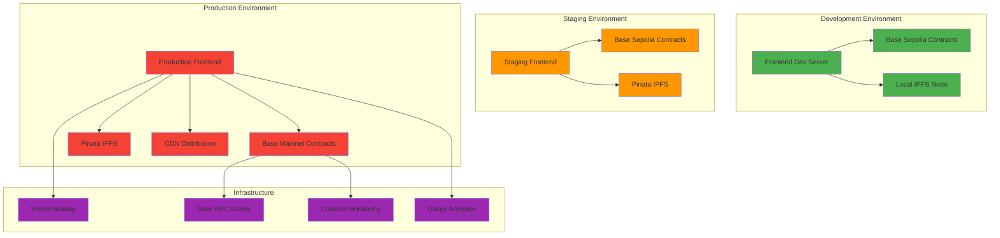

## 🔒 Security & Admin System Architecture

### 🛡️ Admin Access Control System

```mermaid
graph TB
    subgraph "🔐 Admin Authentication"
        DEFAULT[Default Admin<br/>0xc2564e41B7F5Cb66d2d99466450CfebcE9e8228f]
        WALLET_CHECK[Wallet Verification<br/>Address validation]
        AUTH_STATE[Authentication State<br/>Login status tracking]
    end
    
    subgraph "👥 Admin Management (CRUD)"
        ADD_ADMIN[Add Admin<br/>Address + label validation]
        EDIT_ADMIN[Edit Admin<br/>Update labels & settings]
        REMOVE_ADMIN[Remove Admin<br/>Soft delete (deactivate)]
        LIST_ADMINS[List Admins<br/>View all administrators]
    end
    
    subgraph "🎯 Access Control"
        ROUTE_PROTECTION[Route Protection<br/>Admin page access]
        MENU_VISIBILITY[Menu Visibility<br/>Hide/show admin option]
        PERMISSION_CHECK[Permission Check<br/>Real-time validation]
    end
    
    subgraph "💾 Data Management"
        LOCAL_STORAGE[localStorage<br/>Admin wallet storage]
        BACKUP_EXPORT[Backup Export<br/>JSON download]
        IMPORT_RESTORE[Import Restore<br/>JSON upload]
        DATA_VALIDATION[Data Validation<br/>Address format checks]
    end
    
    subgraph "🔒 Security Features"
        DEFAULT_PROTECTION[Default Admin Protection<br/>Cannot remove/deactivate]
        SESSION_MANAGEMENT[Session Management<br/>Auto-refresh checks]
        INPUT_VALIDATION[Input Validation<br/>Address & format checks]
        ERROR_HANDLING[Error Handling<br/>Graceful failures]
    end
    
    %% Authentication flow
    WALLET_CHECK --> DEFAULT
    WALLET_CHECK --> AUTH_STATE
    AUTH_STATE --> PERMISSION_CHECK
    
    %% CRUD operations
    ADD_ADMIN --> DATA_VALIDATION
    EDIT_ADMIN --> DATA_VALIDATION
    REMOVE_ADMIN --> DEFAULT_PROTECTION
    LIST_ADMINS --> LOCAL_STORAGE
    
    %% Access control
    PERMISSION_CHECK --> ROUTE_PROTECTION
    PERMISSION_CHECK --> MENU_VISIBILITY
    AUTH_STATE --> ROUTE_PROTECTION
    
    %% Data management
    DATA_VALIDATION --> LOCAL_STORAGE
    LOCAL_STORAGE --> BACKUP_EXPORT
    IMPORT_RESTORE --> LOCAL_STORAGE
    
    %% Security
    DEFAULT_PROTECTION --> ERROR_HANDLING
    SESSION_MANAGEMENT --> PERMISSION_CHECK
    INPUT_VALIDATION --> DATA_VALIDATION
    
    classDef auth fill:#4caf50,stroke:#2e7d32,color:#fff
    classDef crud fill:#2196f3,stroke:#1565c0,color:#fff
    classDef access fill:#ff9800,stroke:#ef6c00,color:#fff
    classDef data fill:#9c27b0,stroke:#6a1b9a,color:#fff
    classDef security fill:#f44336,stroke:#c62828,color:#fff
    
    class DEFAULT,WALLET_CHECK,AUTH_STATE auth
    class ADD_ADMIN,EDIT_ADMIN,REMOVE_ADMIN,LIST_ADMINS crud
    class ROUTE_PROTECTION,MENU_VISIBILITY,PERMISSION_CHECK access
    class LOCAL_STORAGE,BACKUP_EXPORT,IMPORT_RESTORE,DATA_VALIDATION data
    class DEFAULT_PROTECTION,SESSION_MANAGEMENT,INPUT_VALIDATION,ERROR_HANDLING security
```

### 🔐 Overall Security Architecture

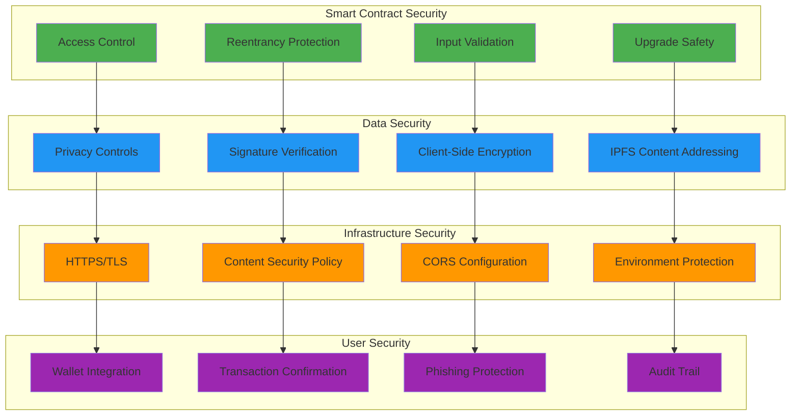

## 📊 Performance Optimization

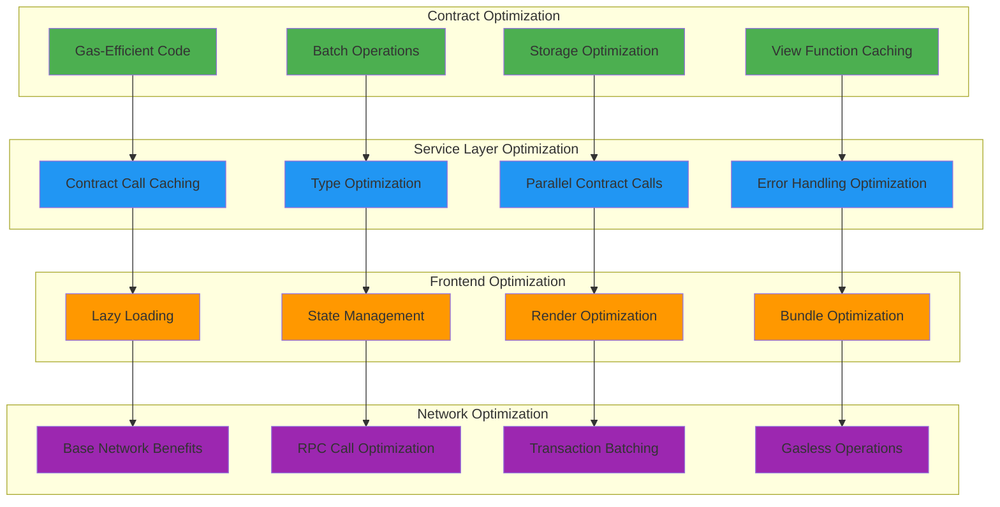

## 🔮 Future Architecture Evolution

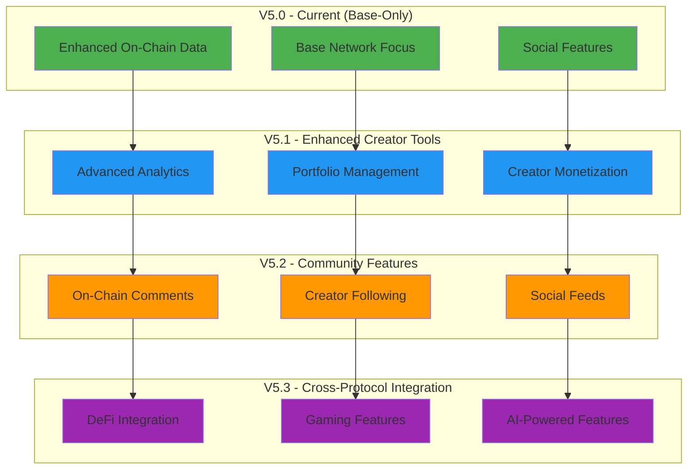

## 📈 Scalability Considerations

### Horizontal Scaling
- **Multiple Collection Contracts**: Support for unlimited collections
- **Factory Pattern**: Efficient contract deployment and management
- **Modular Architecture**: Independent scaling of different components

### Vertical Scaling
- **Gas Optimization**: Efficient use of Base network resources
- **Storage Optimization**: Minimal on-chain storage with maximum utility
- **Caching Strategies**: Smart caching at service and frontend layers

### Future-Proofing
- **Upgradeable Contracts**: Safe upgrade patterns for critical improvements
- **API Versioning**: Backward-compatible service evolution
- **Data Migration**: Seamless migration between contract versions

This V5 architecture represents a significant evolution in NFT platform design, prioritizing decentralization, performance, and user experience while maintaining the flexibility to evolve with the growing Base ecosystem.