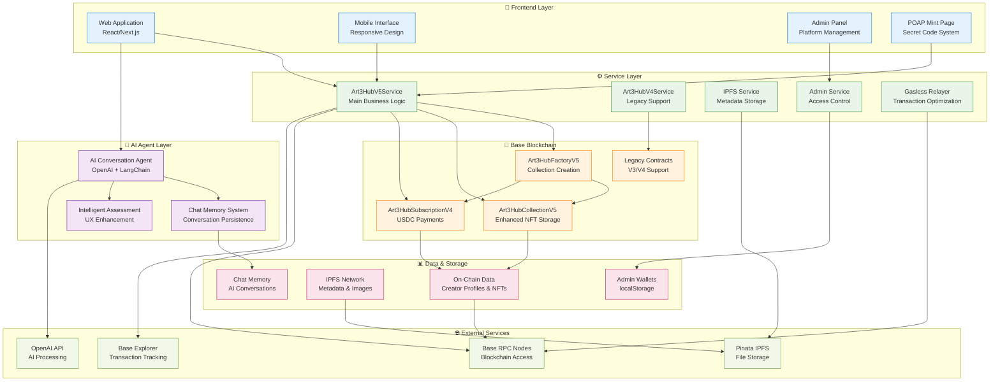
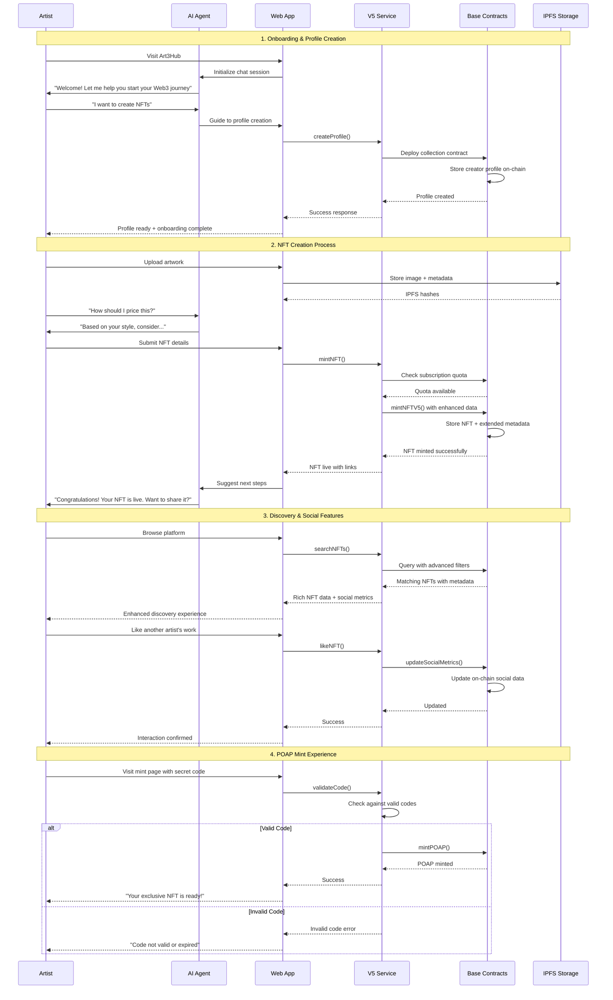
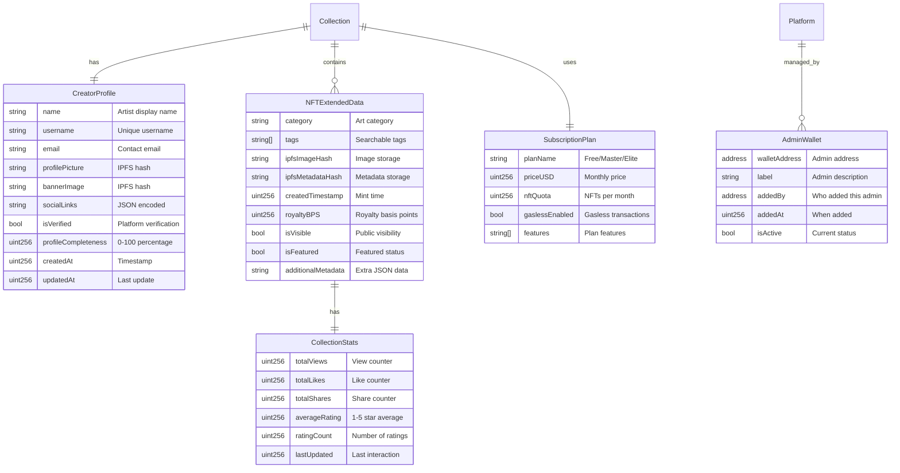
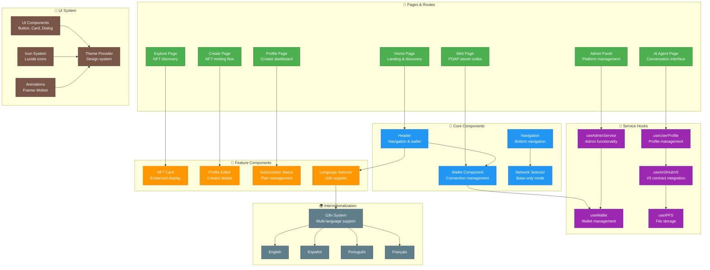
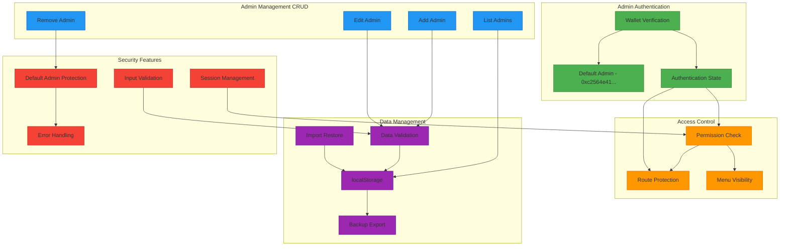

# ART3-HUB


**🏆 #1 Ranked Subcategory Mini App on Base** - Our innovative mini app acts as an guide and transactional bridge for artists entering Web3. It combines a custom AI agent that offers step-by-step guidance—from what a wallet is to how to mint an NFT—with integrated tools that allow users to mint their creations directly, without technical knowledge. 
Mini app: https://farcaster.xyz/miniapps/HiSz_AYGZ62l/art3-hub
Team: 
- Julio M Cruz - CTO 
Dynamic and innovative Onchain developer with a robust ability to analyze and implement decentralized solutions. I have profound expertise in cloud integrations, demonstrate top-tier problem-solving aptitude, and excel in collaborative settings, driving projects to fruition.

- Ivanna León – CEO
-  Founder of Nounish IRL, she bridges educational vision with Web3 development, leading teams and initiatives to scale impact from LATAM. Prev COO at  [dened.org](https://dened.org/), a profitable edtech winner of Startup Peru.

# 🎨 AI Art Hub — An Onboarding Agent for Creatives in Web3

AI-powered onboarding experience that helps visual artists (especially in LATAM) easily enter Web3—mint NFTs, set up wallets, understand royalties, and deploy collections, all without writing a single line of code.

## 🚀 Built for the Base Hackathon

This Mini App combines AI Agents + Base onchain tools to make onboarding frictionless and creative-first.

---

> **🏆 BREAKING NEWS (September 4, 2025): ART3-HUB reaches #1 in Base Educational Mini Apps Ranking!**

<div align="center">
  

  **🎉 Art3 Hub is now ranked #1 in Base's Mini Apps sub-category!**
  
  *Competing with top Web3 platforms, Art3 Hub stands out as the premier AI-driven NFT creation and Web3 onboarding platform for artists.*
</div>

---

> **🚀 Latest Update (August 2025): ART3-HUB V6 with Firebase Integration & Fresh Smart Contracts**

## 🔥 V6 Major Updates

- **🗄️ Database Migration**: Complete migration from Supabase to Firebase for improved scalability
- **🆕 Fresh V6 Contracts**: New smart contracts deployed on **Base Mainnet & Sepolia** with clean addresses
- **🛡️ Enhanced Admin System**: Configurable admin wallet system with environment-based security
- **🧹 Clean Architecture**: Fresh start with optimized Base-only deployment
- **⚡ Improved Performance**: Enhanced on-chain data storage and social features
- **🤖 AI Agent Integration**: Advanced AI-powered guidance system for Web3 onboarding
- **💎 Claimable NFT Factory Pattern**: Independent contracts for user differentiation and access control

### 📋 V6 Contract Addresses

#### 🚀 Base Mainnet (Production - ACTIVE)
- **Factory V6**: `0x8E8f86a2e5BCb6436474833764B3C68cEF89D18D`
- **Subscription V6**: `0x2380a7e74480d44f2Fe05B8cA2BDc9d012F56BE8`
- **Collection Implementation V6**: `0x8aFf71f5dCb7Ad2C77f0Ec5a0A4D914394dB8c13`
- **ClaimableNFT Factory**: `0xB253b65b330A51DD452f32617730565d6f6A6b33`

#### 🧪 Base Sepolia (Testing)
- **Factory V6**: `0x87DfC71B55a41825fe8EAA8a8724D8982b92DeBe`
- **Subscription V6**: `0x3B2D7fD4972077Fa1dbE60335c6CDF84b02fE555`
- **Collection Implementation V6**: `0xA7a5C3c097f291411501129cB69029eCe0F7C45E`
- **ClaimableNFT Factory**: `0x51dD5FE61CF5B537853877A6dE50E7F74c24310A`

#### 🔐 System Configuration
- **Admin Wallet**: `0xc2564e41B7F5Cb66d2d99466450CfebcE9e8228f`
- **Treasury Wallet**: `0x946b7dc627D245877BDf9c59bce626db333Fc01c`
- **Gasless Relayer**: `0x825f993Da8912Ae70545F8e6AD47eBCeCe0fdFCd`

---

## ✨ Features

- Base NFT minting via Agent
- Smart Wallet creation + gasless interactions
- Personalized artist guidance (AI chat-based)
- Basename support for easier login
- Cultural adaptation for LATAM creatives

## 🧠 Stack

- **Frontend**: React 19 + Next.js 15 + TypeScript + Tailwind CSS
- **Backend**: Node.js + Next.js API Routes
- **Database**: **Firebase Firestore** (migrated from Supabase) - **NEW in V6**
- **Storage**: Firebase Storage + Pinata IPFS
- **AI System**: OpenAI GPT-4 + LangChain + Custom Memory System
- **Smart Contracts**: **Art3Hub V6 Contracts** (Base Mainnet + Sepolia deployment) - **PRODUCTION READY**
- **Web3**: Privy + Wagmi + Viem + Base Smart Wallets & Basenames + Farcaster MiniApp Integration
- **Blockchain**: Solidity 0.8.28 + Hardhat + OpenZeppelin + Base Network

## 👤 Team

Created by Escuela de Arte Nounish 
Built with ❤️ from LATAM.

## 📸 Screenshots

## 🧑‍🎨 Target User

Visual artists (painters, illustrators, 3D artists) from underrepresented communities—especially in LATAM—who want to enter Web3 creatively and safely.

## 🚀 How It Works

1. **Landing & Onboarding**: User lands on the hub and interacts with an AI Agent through intelligent chat system
2. **AI-Guided Journey**: The agent provides step-by-step guidance to mint NFTs, connect wallet, understand royalties and Web3 concepts
3. **Gasless Operations**: All actions are powered by gasless smart wallets on Base with EIP-712 meta-transactions
4. **NFT Creation**: Users can create collections and mint NFTs with subscription-based quota management
5. **Claimable NFT Factory**: Independent contracts for user differentiation and exclusive access control
6. **Gasless Experience**: Complete gasless operations for claimable NFT interactions
7. **Firebase Integration**: Real-time data synchronization and scalable backend infrastructure

## 🛠️ Setup (Dev Mode)

### Prerequisites
- Node.js 16+
- npm or yarn
- Firebase project setup
- Web3 wallet (MetaMask, Coinbase Wallet, etc.)

### Installation

```bash
# Clone the repository
git clone https://github.com/JulioMCruz/ART3-HUB.git
cd ART3-HUB

# Install dependencies for all components
cd ArtHubApp && npm install
cd ../ArtHubContract && npm install
cd ../ArtHubAgent && npm install

# Test claimable NFT factory system
cd ../ArtHubTests
node check-deployments.js          # Verify factory deployment
node test-gasless-port-3000.js     # Test gasless operations

# Setup environment variables
cp ArtHubApp/.env.example ArtHubApp/.env
cp ArtHubContract/.env.example ArtHubContract/.env

# Start development servers
cd ArtHubApp && npm run dev
```

### Environment Configuration

Configure your Firebase and Web3 settings in `.env` files:
- Firebase API keys and project configuration
- Smart contract addresses (V6 Base Mainnet & Sepolia)
- IPFS storage credentials (Pinata)
- OpenAI API key for AI agent
- Network mode configuration (mainnet/testnet)

# 🎨 Art Hub — Mini App for Web3 Artists (Base Hackathon)

## ✨ What is Art3 Hub?

A creative-first Mini App that helps artists enter Web3 **without needing to code**.

Built for **visual artists in LATAM** and beyond, this AI-powered assistant handles wallet creation, NFT minting, and learning—all in one smooth flow.

---

## 🔁 Workflow Overview

### 👤 1. Artist lands on Art Hub

- Arrives on a simple, artist-friendly landing page.
- Greeted by an **AI Agent chat interface**.

🖼️ *"Hi! Want to mint your art onchain? I can guide you!"*

---

### 🔐 2. Create or connect a wallet

- The AI Agent helps create a **Base Smart Wallet** (via embedded flow).
- Optionally claim a **Basename**.
- No seed phrases or browser extensions needed.

🧠 *"Would you like me to create your wallet? Just confirm."*

---

### 🖌️ 3. Upload artwork + metadata

- Artists can:
  - Drag-and-drop their image, or
  - Paste a link / upload via chat.
- AI Agent asks for description, royalties, collection name, etc.
- Prepares metadata for minting.

🎨 *"Tell me more about your piece—I'll handle the rest!"*

---

### 🪄 4. Mint NFT on Zora via Base

- Using **Zora SDK/API**, the AI executes the mint onchain.
- Agent confirms when NFT is live and shareable.

🔗 *"Your NFT is minted! Here's the link to Zora."*

---

### 🧭 Optional: Learn Web3 step-by-step

- The AI can explain:
  - What's an NFT?
  - How to build a collection?
  - How royalties work?
- Contextual responses powered by LangChain + OpenAI.

📚 *"Want to explore how to sell your art onchain?"*

---

## ⚙️ Technologies Used

| Feature         | Stack / Tool                  |
|-----------------|-------------------------------|
| Frontend        | React 19 + Next.js 15 + TypeScript |
| Styling         | Tailwind CSS + shadcn/ui     |
| Hosting         | Vercel                        |
| Database        | Firebase Firestore           |
| Storage         | Firebase Storage + Pinata IPFS |
| AI Agent        | OpenAI GPT-4 + LangChain     |
| Smart Contracts | Art3Hub V6 (Solidity 0.8.28) |
| Web3 Integration| Privy + Wagmi + Viem         |
| Wallets         | Base Smart Wallets + MetaMask |
| Blockchain      | Base Network (Sepolia/Mainnet) |
| Authentication  | Privy + Basenames            |

---

## ✅ Why It's a Mini App

- 🧠 Smart, agent-guided flow (vs traditional dapps)
- 🚪 Fast onboarding: From zero to mint in 3 steps
- 🎨 Artist-first UX with no crypto knowledge required
- 🧩 Embedded wallet, AI, and minting flow

---

## 🚀 Built for Base Hackathon

Created with ❤️ by a team in LATAM to help artists **onboard, mint, and thrive** onchain.


ROADMAP
2025-2026: Launch & Optimization

Goal: Activate early users and refine core experience
	•	Launch full version of AI onboarding agent
	•	Integrate curated grant/opportunity feed
	•	Roll out Elite Creator Plan & Collector Subscription
	•	Start marketing campaign in Peru, Argentina, Mexico
	•	Initial partnerships with 2–3 artist collectives
	•	UX/UI optimization (based on feedback)

🧠 Success Metrics:
	•	1,000 total users
	•	15% free-to-paid conversion
	•	+50 NFTs minted
	•	First 5 grants matched via platform

⸻

📍Q1 2026: Monetization & Expansion

Goal: Start scaling revenue and international traction
	•	Launch Collector Dashboard (early access drops + rewards)
	•	Artist Showcase Feature for top creators
	•	Onboard 5 strategic partners (galleries, DAOs, grant platforms)
	•	Start monetizing marketplace activity (platform fees)
	•	First 2 artist success stories published

🧠 Success Metrics:
	•	$2K MRR
	•	3,000 total users
	•	100 paid users
	•	300 NFTs minted
	•	First collector subscriptions

⸻

📍Q2 2026: Scale & Institutional Reach

Goal: Move from product-market fit to platform leadership
	•	Begin partnership with cultural institutions & NGOs
	•	Introduce mobile app (beta)
	•	Launch marketplace boost & featured collections (upsell feature)
	•	Prepare for pre-seed fundraising round or grant scaling

🧠 Success Metrics:
	•	10,000 total users
	•	1,000+ NFTs minted
	•	$10K+ MRR
	•	50% retention rate
	•	Onboarded 10 institutional partners

---

---

# 📚 Technical Architecture Documentation

## 🏗️ System Architecture Overview

Art3Hub V5 represents a comprehensive Web3 creative platform with multiple integrated components working together to provide seamless NFT creation, management, and discovery.



---

## 🎯 User Journey & Feature Flow

### 🚀 Complete User Experience Flow



---

## 🏛️ Smart Contract Architecture

### 📋 Contract System Overview

```mermaid
graph TB
    subgraph "🏭 Factory Layer - Art3HubFactoryV5"
        F_CREATE[createCollectionV5<br/>Deploy new collections]
        F_MINT[mintNFTV5<br/>Enhanced minting]
        F_SEARCH[searchCollections<br/>Discovery functions]
        F_ANALYTICS[getPlatformStats<br/>Analytics data]
        F_ADMIN[Admin Functions<br/>Platform management]
    end
    
    subgraph "🎨 Collection Layer - Art3HubCollectionV5"
        C_PROFILE[Creator Profiles<br/>On-chain artist data]
        C_NFT[Enhanced NFT Data<br/>Extended metadata]
        C_SOCIAL[Social Features<br/>Likes, views, shares]
        C_SEARCH[Search Functions<br/>Advanced filtering]
        C_PRIVACY[Privacy Controls<br/>Visibility settings]
    end
    
    subgraph "💳 Subscription Layer - Art3HubSubscriptionV4"
        S_PLANS[Subscription Plans<br/>Free, Master, Elite]
        S_PAYMENT[USDC Payments<br/>Secure transactions]
        S_QUOTA[Quota Management<br/>Usage tracking]
        S_GASLESS[Gasless Features<br/>Transaction optimization]
    end
    
    subgraph "🔒 Admin System"
        A_WALLETS[Admin Wallets<br/>Access control]
        A_CRUD[CRUD Operations<br/>Add/remove admins]
        A_PROTECTION[Route Protection<br/>Secure admin access]
    end
    
    subgraph "📊 Data Structures"
        DS_CREATOR[CreatorProfile<br/>Name, bio, socials, verification]
        DS_NFT[NFTExtendedData<br/>Category, tags, IPFS, timestamps]
        DS_STATS[CollectionStats<br/>Views, likes, ratings]
        DS_PLATFORM[PlatformStats<br/>Global analytics]
    end
    
    %% Factory connections
    F_CREATE --> C_PROFILE
    F_MINT --> C_NFT
    F_SEARCH --> C_SEARCH
    F_ANALYTICS --> DS_PLATFORM
    F_ADMIN --> A_WALLETS
    
    %% Collection connections
    C_PROFILE --> DS_CREATOR
    C_NFT --> DS_NFT
    C_SOCIAL --> DS_STATS
    
    %% Subscription connections
    F_CREATE --> S_PLANS
    F_MINT --> S_QUOTA
    S_PAYMENT --> S_GASLESS
    
    %% Admin connections
    A_WALLETS --> A_CRUD
    A_CRUD --> A_PROTECTION
    
    classDef factory fill:#4caf50,stroke:#2e7d32,color:#fff
    classDef collection fill:#2196f3,stroke:#1565c0,color:#fff
    classDef subscription fill:#ff9800,stroke:#ef6c00,color:#fff
    classDef admin fill:#9c27b0,stroke:#6a1b9a,color:#fff
    classDef data fill:#607d8b,stroke:#37474f,color:#fff
    
    class F_CREATE,F_MINT,F_SEARCH,F_ANALYTICS,F_ADMIN factory
    class C_PROFILE,C_NFT,C_SOCIAL,C_SEARCH,C_PRIVACY collection
    class S_PLANS,S_PAYMENT,S_QUOTA,S_GASLESS subscription
    class A_WALLETS,A_CRUD,A_PROTECTION admin
    class DS_CREATOR,DS_NFT,DS_STATS,DS_PLATFORM data
```



### 🔗 Enhanced Data Model



---

## 🤖 AI Agent System Architecture

### 🧠 Intelligent Conversation Flow

```mermaid
graph TB
    subgraph "🎯 AI Agent Core"
        CHAT[Chat Interface<br/>Real-time conversation]
        MEMORY[Memory System<br/>Conversation persistence]
        CONTEXT[Context Awareness<br/>User state tracking]
        ASSESSMENT[Intelligent Assessment<br/>UX enhancement]
    end
    
    subgraph "📚 Knowledge Base"
        WEB3[Web3 Education<br/>NFTs, wallets, gas]
        PLATFORM[Platform Guide<br/>Features & workflows]
        BEST_PRACTICES[Best Practices<br/>Pricing, marketing]
        TROUBLESHOOT[Troubleshooting<br/>Common issues]
    end
    
    subgraph "🎨 Creative Assistance"
        ART_ADVICE[Art Guidance<br/>Composition, style]
        PRICING[Pricing Strategy<br/>Market analysis]
        MARKETING[Marketing Tips<br/>Social promotion]
        COLLECTION[Collection Building<br/>Series creation]
    end
    
    subgraph "⚡ Action Integration"
        WALLET_HELP[Wallet Setup<br/>Connection assistance]
        MINT_GUIDE[Minting Guide<br/>Step-by-step help]
        PROFILE_SETUP[Profile Creation<br/>Onboarding flow]
        DISCOVERY[Discovery Help<br/>Finding collectors]
    end
    
    subgraph "🔗 External Integrations"
        OPENAI[OpenAI API<br/>Language processing]
        LANGCHAIN[LangChain<br/>Agent framework]
        ANALYTICS[Usage Analytics<br/>Conversation tracking]
        FEEDBACK[User Feedback<br/>Continuous improvement]
    end
    
    %% Core connections
    CHAT --> MEMORY
    CHAT --> CONTEXT
    CHAT --> ASSESSMENT
    MEMORY --> CONTEXT
    
    %% Knowledge connections
    CONTEXT --> WEB3
    CONTEXT --> PLATFORM
    CONTEXT --> BEST_PRACTICES
    CONTEXT --> TROUBLESHOOT
    
    %% Creative connections
    CHAT --> ART_ADVICE
    CHAT --> PRICING
    CHAT --> MARKETING
    CHAT --> COLLECTION
    
    %% Action connections
    ASSESSMENT --> WALLET_HELP
    ASSESSMENT --> MINT_GUIDE
    ASSESSMENT --> PROFILE_SETUP
    ASSESSMENT --> DISCOVERY
    
    %% External connections
    CHAT --> OPENAI
    CONTEXT --> LANGCHAIN
    MEMORY --> ANALYTICS
    ASSESSMENT --> FEEDBACK
    
    classDef core fill:#4caf50,stroke:#2e7d32,color:#fff
    classDef knowledge fill:#2196f3,stroke:#1565c0,color:#fff
    classDef creative fill:#ff9800,stroke:#ef6c00,color:#fff
    classDef action fill:#9c27b0,stroke:#6a1b9a,color:#fff
    classDef external fill:#607d8b,stroke:#37474f,color:#fff
    
    class CHAT,MEMORY,CONTEXT,ASSESSMENT core
    class WEB3,PLATFORM,BEST_PRACTICES,TROUBLESHOOT knowledge
    class ART_ADVICE,PRICING,MARKETING,COLLECTION creative
    class WALLET_HELP,MINT_GUIDE,PROFILE_SETUP,DISCOVERY action
    class OPENAI,LANGCHAIN,ANALYTICS,FEEDBACK external
```



---

## 🌐 Frontend Architecture & Components

### 🎨 Component System Overview



---

## 🔒 Security & Admin System Architecture

### 🛡️ Admin Access Control System



---

## 🚀 Deployment & Infrastructure

### 🌐 Multi-Environment Deployment Strategy

```mermaid
graph TB
    subgraph "🔧 Development Environment"
        DEV_APP[Local Development<br/>Next.js dev server]
        DEV_CONTRACTS[Base Sepolia<br/>Test contracts]
        DEV_IPFS[Local IPFS<br/>Development storage]
        DEV_AI[OpenAI API<br/>Development key]
    end
    
    subgraph "🧪 Staging Environment"
        STAGING_APP[Staging Deployment<br/>Vercel preview]
        STAGING_CONTRACTS[Base Sepolia<br/>Staging contracts]
        STAGING_IPFS[Pinata IPFS<br/>Staging storage]
        STAGING_AI[OpenAI API<br/>Staging key]
    end
    
    subgraph "🏭 Production Environment"
        PROD_APP[Production App<br/>Vercel deployment]
        PROD_CONTRACTS[Base Mainnet<br/>Live contracts]
        PROD_IPFS[Pinata IPFS<br/>Production storage]
        PROD_AI[OpenAI API<br/>Production key]
        PROD_CDN[CDN Distribution<br/>Global delivery]
    end
    
    subgraph "📊 Infrastructure Services"
        VERCEL[Vercel Platform<br/>App hosting]
        BASE_RPC[Base RPC Nodes<br/>Blockchain access]
        MONITORING[Contract Monitoring<br/>Health checks]
        ANALYTICS[Usage Analytics<br/>Performance tracking]
        BACKUP[Backup Systems<br/>Data protection]
    end
    
    subgraph "🔒 Security Infrastructure"
        ENV_PROTECTION[Environment Variables<br/>Secret management]
        API_SECURITY[API Rate Limiting<br/>Abuse prevention]
        HTTPS[HTTPS/TLS<br/>Secure connections]
        CSP[Content Security Policy<br/>XSS protection]
    end
    
    %% Development connections
    DEV_APP --> DEV_CONTRACTS
    DEV_APP --> DEV_IPFS
    DEV_APP --> DEV_AI
    
    %% Staging connections
    STAGING_APP --> STAGING_CONTRACTS
    STAGING_APP --> STAGING_IPFS
    STAGING_APP --> STAGING_AI
    
    %% Production connections
    PROD_APP --> PROD_CONTRACTS
    PROD_APP --> PROD_IPFS
    PROD_APP --> PROD_AI
    PROD_APP --> PROD_CDN
    
    %% Infrastructure connections
    PROD_APP --> VERCEL
    PROD_CONTRACTS --> BASE_RPC
    PROD_CONTRACTS --> MONITORING
    PROD_APP --> ANALYTICS
    VERCEL --> BACKUP
    
    %% Security connections
    DEV_APP --> ENV_PROTECTION
    STAGING_APP --> API_SECURITY
    PROD_APP --> HTTPS
    PROD_APP --> CSP
    
    classDef dev fill:#4caf50,stroke:#2e7d32,color:#fff
    classDef staging fill:#ff9800,stroke:#ef6c00,color:#fff
    classDef prod fill:#f44336,stroke:#c62828,color:#fff
    classDef infra fill:#9c27b0,stroke:#6a1b9a,color:#fff
    classDef security fill:#607d8b,stroke:#37474f,color:#fff
    
    class DEV_APP,DEV_CONTRACTS,DEV_IPFS,DEV_AI dev
    class STAGING_APP,STAGING_CONTRACTS,STAGING_IPFS,STAGING_AI staging
    class PROD_APP,PROD_CONTRACTS,PROD_IPFS,PROD_AI,PROD_CDN prod
    class VERCEL,BASE_RPC,MONITORING,ANALYTICS,BACKUP infra
    class ENV_PROTECTION,API_SECURITY,HTTPS,CSP security
```



---

## 🛠️ Technical Stack Details

### 🏗️ Architecture Stack

| Layer | Technologies | Purpose |
|-------|-------------|---------|
| **Frontend** | React 18, Next.js 14, TypeScript, Tailwind CSS | User interface and experience |
| **AI System** | OpenAI GPT-4, LangChain, Custom memory system | Intelligent conversation and guidance |
| **Blockchain** | Solidity 0.8.28, Base Network, Hardhat | Smart contracts and on-chain data |
| **Storage** | IPFS, Pinata, localStorage | Decentralized and local data storage |
| **Services** | Custom service layer, Wagmi, Privy | Business logic and wallet integration |
| **Infrastructure** | Vercel, Base RPC, GitHub Actions | Deployment and CI/CD |

### 🔧 Development Tools

- **Smart Contracts**: Hardhat, TypeChain, OpenZeppelin
- **Frontend**: Next.js, React, TypeScript, Tailwind CSS
- **Testing**: Vitest, Playwright, Hardhat tests
- **Deployment**: Vercel, Base blockchain deployment scripts
- **Code Quality**: ESLint, Prettier, TypeScript strict mode

---

## 📚 Documentation Links

- [**Architecture V5**](./ARCHITECTURE_V5.md) - Detailed technical architecture
- [**Smart Contract Documentation**](./ArtHubContract/README.md) - Contract specifications
- [**Frontend Setup Guide**](./ArtHubApp/README.md) - Frontend development guide
- [**Test Suite Documentation**](./ArtHubTests/README.md) - Claimable NFT factory testing guide
- [**AI Agent Documentation**](./ArtHubApp/docs/INTELLIGENT_CHAT_SYSTEM.md) - AI system details
- [**Deployment Guide**](./ArtHubContract/DEPLOY_V5.md) - Contract deployment instructions
