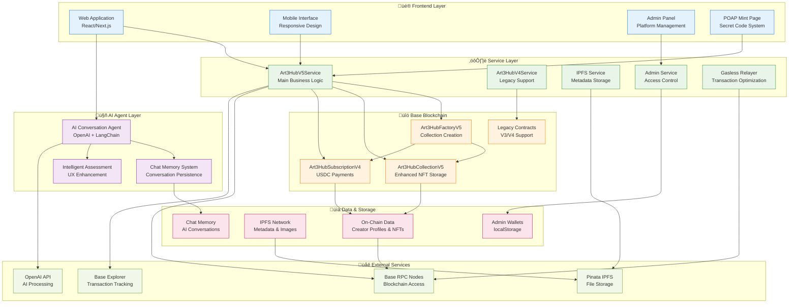
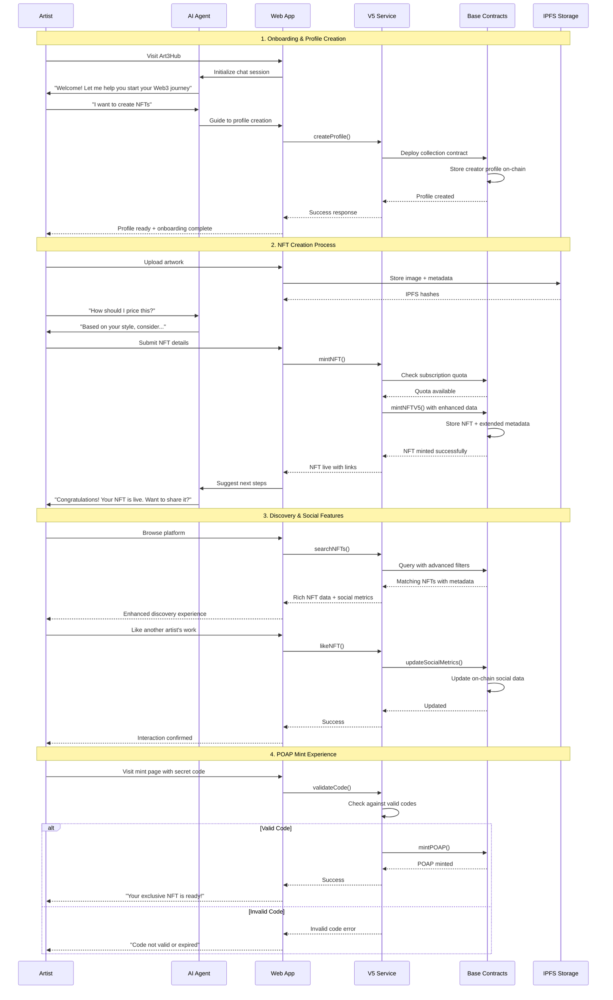
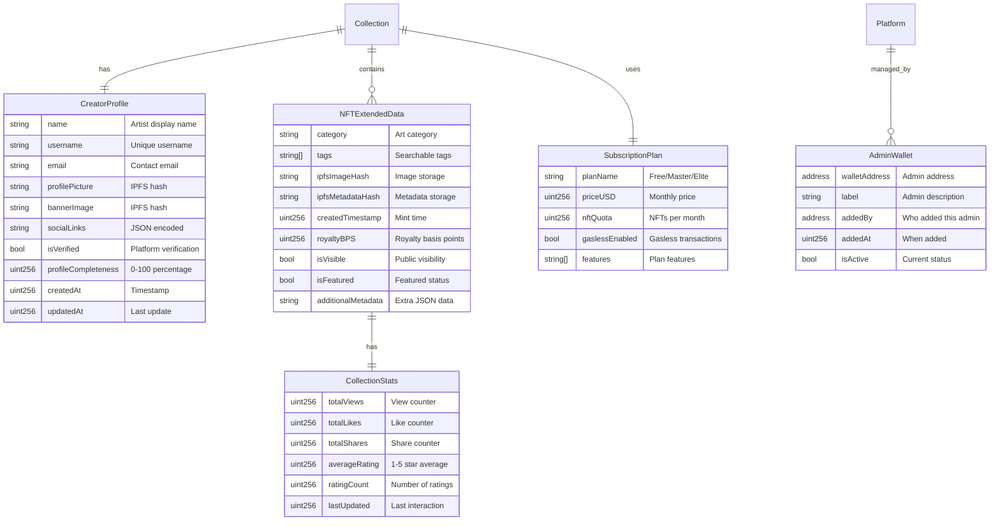
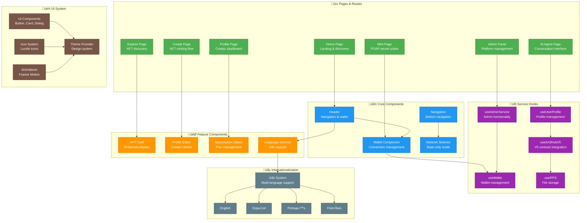
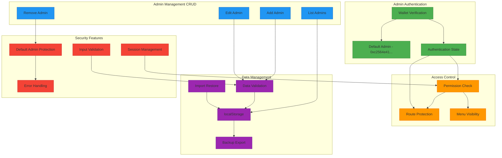

# ART3-HUB
Mini app built on Base that acts as an educational and transactional bridge for artists entering Web3. It combines a custom AI agent that offers step-by-step guidance—from what a wallet is to how to mint an NFT—with integrated tools that allow users to mint their creations directly, without technical knowledge. 
Mini app: https://farcaster.xyz/miniapps/HiSz_AYGZ62l/art3-hub
Team: 
- Julio M Cruz https://github.com/JulioMCruz
Dynamic and innovative Onchain developer with a robust ability to analyze and implement decentralized solutions. I have profound expertise in cloud integrations, demonstrate top-tier problem-solving aptitude, and excel in collaborative settings, driving projects to fruition.

- Ivanna León – Project Manager & Community Lead: Founder of Nounish IRL, she bridges educational vision with Web3 development, leading teams and initiatives to scale impact from LATAM.
  
- Claudio CMO
-  Visual artist & creative director with 10+ years in the arts field
	•	Built a personal brand with 30K+ followers across platforms (Instagram, TikTok, X)
	•	Leads communities with 12K+ members, focused on creators and web3 onboarding
	•	Has organically reached over 3 million views with art and web3-related content

  

Question from Demo Day: 
How will reach collectors?
We have collectors on our IRL community and also we'll taking advantage from web 3 people who spend their money on farcaster

# 🎨 AI Art Hub — An Onboarding Agent for Creatives in Web3

AI-powered onboarding experience that helps visual artists (especially in LATAM) easily enter Web3—mint NFTs, set up wallets, understand royalties, and deploy collections, all without writing a single line of code.

## üöÄ Built for the Base Hackathon

This Mini App combines AI Agents + Base onchain tools to make onboarding frictionless and creative-first.

## ‚ú® Features

- Zora NFT minting via Agent
- Smart Wallet creation + gasless interactions
- Personalized artist guidance (AI chat-based)
- Basename support for easier login
- Cultural adaptation for LATAM creatives

## 🧠 Stack

- React + Tailwind CSS (frontend)
- Node.js (backend)
- OpenAI + LangChain (AI logic)
- Zora SDK (NFT tools)
- Base Smart Wallets & Basenames
- Solidity (optional for contracts)

## 👤 Team

Created by Escuela de Arte Nounish 
Built with ❤️ from LATAM.

## üì∏ Screenshots

## üßë‚Äçüé® Target User

Visual artists (painters, illustrators, 3D artists) from underrepresented communities—especially in LATAM—who want to enter Web3 creatively and safely.

## üöÄ How It Works

1. User lands on the hub and interacts with an AI Agent.
2. The agent guides them step-by-step to mint NFTs, connect wallet, understand royalties.
3. All actions are powered by gasless smart wallets on Base.

## 🛠️ Setup (Dev Mode)

```bash
git clone https://github.com/[your-org]/ai-art-hub.git
cd ai-art-hub
npm install
npm run dev
```

# 🎨 Art Hub — Mini App for Web3 Artists (Base Hackathon)

## ‚ú® What is Art3 Hub?

A creative-first Mini App that helps artists enter Web3 **without needing to code**.

Built for **visual artists in LATAM** and beyond, this AI-powered assistant handles wallet creation, NFT minting, and learning—all in one smooth flow.

---

## 🔁 Workflow Overview

### 👤 1. Artist lands on Art Hub

- Arrives on a simple, artist-friendly landing page.
- Greeted by an **AI Agent chat interface**.

🖼️ *"Hi! Want to mint your art onchain? I can guide you!"*

---

### üîê 2. Create or connect a wallet

- The AI Agent helps create a **Base Smart Wallet** (via embedded flow).
- Optionally claim a **Basename**.
- No seed phrases or browser extensions needed.

🧠 *"Would you like me to create your wallet? Just confirm."*

---

### 🖌️ 3. Upload artwork + metadata

- Artists can:
  - Drag-and-drop their image, or
  - Paste a link / upload via chat.
- AI Agent asks for description, royalties, collection name, etc.
- Prepares metadata for minting.

🎨 *"Tell me more about your piece—I'll handle the rest!"*

---

### 🪄 4. Mint NFT on Zora via Base

- Using **Zora SDK/API**, the AI executes the mint onchain.
- Agent confirms when NFT is live and shareable.

üîó *"Your NFT is minted! Here's the link to Zora."*

---

### üß≠ Optional: Learn Web3 step-by-step

- The AI can explain:
  - What's an NFT?
  - How to build a collection?
  - How royalties work?
- Contextual responses powered by LangChain + OpenAI.

üìö *"Want to explore how to sell your art onchain?"*

---

## ⚙️ Technologies Used

| Feature         | Stack / Tool             |
|-----------------|--------------------------|
| Frontend        | React + Tailwind CSS     |
| Hosting         | Vercel / Netlify         |
| AI Agent        | LangChain + OpenAI       |
| Minting         | Zora SDK/API             |
| Wallets         | Base Smart Wallets       |
| Login System    | Basenames                |
| Storage         | IPFS / Zora's media kit  |

---

## ‚úÖ Why It's a Mini App

- 🧠 Smart, agent-guided flow (vs traditional dapps)
- üö™ Fast onboarding: From zero to mint in 3 steps
- üé® Artist-first UX with no crypto knowledge required
- üß© Embedded wallet, AI, and minting flow

---

## üöÄ Built for Base Hackathon

Created with ❤️ by a team in LATAM to help artists **onboard, mint, and thrive** onchain.


ROADMAP
2025: Launch & Optimization

Goal: Activate early users and refine core experience
	•	Launch full version of AI onboarding agent
	•	Integrate curated grant/opportunity feed
	•	Roll out Elite Creator Plan & Collector Subscription
	•	Start marketing campaign in Peru, Argentina, Mexico
	•	Initial partnerships with 2–3 artist collectives
	•	UX/UI optimization (based on feedback)

🧠 Success Metrics:
	•	1,000 total users
	•	15% free-to-paid conversion
	•	+50 NFTs minted
	•	First 5 grants matched via platform

⸻

üìçQ4 2025: Monetization & Expansion

Goal: Start scaling revenue and international traction
	•	Launch Collector Dashboard (early access drops + rewards)
	•	Artist Showcase Feature for top creators
	•	Onboard 5 strategic partners (galleries, DAOs, grant platforms)
	•	Start monetizing marketplace activity (platform fees)
	•	First 2 artist success stories published

🧠 Success Metrics:
	•	$2K MRR
	•	3,000 total users
	•	100 paid users
	•	300 NFTs minted
	•	First collector subscriptions

⸻

üìçQ2 2026: Scale & Institutional Reach

Goal: Move from product-market fit to platform leadership
	•	Begin partnership with cultural institutions & NGOs
	•	Introduce mobile app (beta)
	•	Launch marketplace boost & featured collections (upsell feature)
	•	Prepare for pre-seed fundraising round or grant scaling

🧠 Success Metrics:
	•	10,000 total users
	•	1,000+ NFTs minted
	•	$10K+ MRR
	•	50% retention rate
	•	Onboarded 10 institutional partners

---

---

# üìö Technical Architecture Documentation

## 🏗️ System Architecture Overview

Art3Hub V5 represents a comprehensive Web3 creative platform with multiple integrated components working together to provide seamless NFT creation, management, and discovery.


```mermaid
graph TB
    subgraph "üé® Frontend Layer"
        WEB[Web Application<br/>React/Next.js]
        MOBILE[Mobile Interface<br/>Responsive Design]
        ADMIN[Admin Panel<br/>Platform Management]
        MINT[POAP Mint Page<br/>Secret Code System]
    end
    
    subgraph "🤖 AI Agent Layer"
        AGENT[AI Conversation Agent<br/>OpenAI + LangChain]
        MEMORY[Chat Memory System<br/>Conversation Persistence]
        INTEL[Intelligent Assessment<br/>UX Enhancement]
    end
    
    subgraph "⚙️ Service Layer"
        V5_SVC[Art3HubV5Service<br/>Main Business Logic]
        V4_SVC[Art3HubV4Service<br/>Legacy Support]
        IPFS_SVC[IPFS Service<br/>Metadata Storage]
        ADMIN_SVC[Admin Service<br/>Access Control]
        GASLESS[Gasless Relayer<br/>Transaction Optimization]
    end
    
    subgraph "üîó Base Blockchain"
        FACTORY_V5[Art3HubFactoryV5<br/>Collection Creation]
        COLLECTION_V5[Art3HubCollectionV5<br/>Enhanced NFT Storage]
        SUBSCRIPTION[Art3HubSubscriptionV4<br/>USDC Payments]
        LEGACY[Legacy Contracts<br/>V3/V4 Support]
    end
    
    subgraph "üìä Data & Storage"
        ONCHAIN[On-Chain Data<br/>Creator Profiles & NFTs]
        IPFS[IPFS Network<br/>Metadata & Images]
        MEMORY_DB[Chat Memory<br/>AI Conversations]
        ADMIN_DB[Admin Wallets<br/>localStorage]
    end
    
    subgraph "üåê External Services"
        PINATA[Pinata IPFS<br/>File Storage]
        BASE_RPC[Base RPC Nodes<br/>Blockchain Access]
        EXPLORER[Base Explorer<br/>Transaction Tracking]
        OPENAI[OpenAI API<br/>AI Processing]
    end
    
    %% Frontend connections
    WEB --> V5_SVC
    WEB --> AGENT
    MOBILE --> V5_SVC
    ADMIN --> ADMIN_SVC
    MINT --> V5_SVC
    
    %% AI Agent connections
    AGENT --> MEMORY
    AGENT --> INTEL
    AGENT --> OPENAI
    MEMORY --> MEMORY_DB
    
    %% Service layer connections
    V5_SVC --> FACTORY_V5
    V5_SVC --> COLLECTION_V5
    V5_SVC --> SUBSCRIPTION
    V4_SVC --> LEGACY
    IPFS_SVC --> PINATA
    ADMIN_SVC --> ADMIN_DB
    GASLESS --> BASE_RPC
    
    %% Blockchain connections
    FACTORY_V5 --> COLLECTION_V5
    FACTORY_V5 --> SUBSCRIPTION
    COLLECTION_V5 --> ONCHAIN
    SUBSCRIPTION --> ONCHAIN
    
    %% Data connections
    ONCHAIN --> BASE_RPC
    IPFS --> PINATA
    
    %% External service connections
    V5_SVC --> BASE_RPC
    V5_SVC --> EXPLORER
    
    classDef frontend fill:#e3f2fd,stroke:#1976d2
    classDef ai fill:#f3e5f5,stroke:#7b1fa2
    classDef service fill:#e8f5e8,stroke:#388e3c
    classDef blockchain fill:#fff3e0,stroke:#f57c00
    classDef data fill:#fce4ec,stroke:#c2185b
    classDef external fill:#f1f8e9,stroke:#689f38
    
    class WEB,MOBILE,ADMIN,MINT frontend
    class AGENT,MEMORY,INTEL ai
    class V5_SVC,V4_SVC,IPFS_SVC,ADMIN_SVC,GASLESS service
    class FACTORY_V5,COLLECTION_V5,SUBSCRIPTION,LEGACY blockchain
    class ONCHAIN,IPFS,MEMORY_DB,ADMIN_DB data
    class PINATA,BASE_RPC,EXPLORER,OPENAI external
```

---

## 🎯 User Journey & Feature Flow

### üöÄ Complete User Experience Flow


```mermaid
sequenceDiagram
    participant U as Artist
    participant AI as AI Agent
    participant WEB as Web App
    participant SVC as V5 Service
    participant BC as Base Contracts
    participant IPFS as IPFS Storage
    
    Note over U,IPFS: 1. Onboarding & Profile Creation
    U->>WEB: Visit Art3Hub
    WEB->>AI: Initialize chat session
    AI->>U: "Welcome! Let me help you start your Web3 journey"
    U->>AI: "I want to create NFTs"
    AI->>WEB: Guide to profile creation
    WEB->>SVC: createProfile()
    SVC->>BC: Deploy collection contract
    BC->>BC: Store creator profile on-chain
    BC-->>SVC: Profile created
    SVC-->>WEB: Success response
    WEB-->>U: Profile ready + onboarding complete
    
    Note over U,IPFS: 2. NFT Creation Process
    U->>WEB: Upload artwork
    WEB->>IPFS: Store image + metadata
    IPFS-->>WEB: IPFS hashes
    U->>AI: "How should I price this?"
    AI->>U: "Based on your style, consider..."
    U->>WEB: Submit NFT details
    WEB->>SVC: mintNFT()
    SVC->>BC: Check subscription quota
    BC-->>SVC: Quota available
    SVC->>BC: mintNFTV5() with enhanced data
    BC->>BC: Store NFT + extended metadata
    BC-->>SVC: NFT minted successfully
    SVC-->>WEB: NFT live with links
    WEB->>AI: Suggest next steps
    AI->>U: "Congratulations! Your NFT is live. Want to share it?"
    
    Note over U,IPFS: 3. Discovery & Social Features
    U->>WEB: Browse platform
    WEB->>SVC: searchNFTs()
    SVC->>BC: Query with advanced filters
    BC-->>SVC: Matching NFTs with metadata
    SVC-->>WEB: Rich NFT data + social metrics
    WEB-->>U: Enhanced discovery experience
    
    U->>WEB: Like another artist's work
    WEB->>SVC: likeNFT()
    SVC->>BC: updateSocialMetrics()
    BC->>BC: Update on-chain social data
    BC-->>SVC: Updated
    SVC-->>WEB: Success
    WEB-->>U: Interaction confirmed
    
    Note over U,IPFS: 4. POAP Mint Experience
    U->>WEB: Visit mint page with secret code
    WEB->>SVC: validateCode()
    SVC->>SVC: Check against valid codes
    alt Valid Code
        SVC->>BC: mintPOAP()
        BC-->>SVC: POAP minted
        SVC-->>WEB: Success
        WEB-->>U: "Your exclusive NFT is ready!"
    else Invalid Code
        SVC-->>WEB: Invalid code error
        WEB-->>U: "Code not valid or expired"
    end
```

---

## 🏛️ Smart Contract Architecture

### üìã Contract System Overview


```mermaid
graph TB
    subgraph "üè≠ Factory Layer - Art3HubFactoryV5"
        F_CREATE[createCollectionV5<br/>Deploy new collections]
        F_MINT[mintNFTV5<br/>Enhanced minting]
        F_SEARCH[searchCollections<br/>Discovery functions]
        F_ANALYTICS[getPlatformStats<br/>Analytics data]
        F_ADMIN[Admin Functions<br/>Platform management]
    end
    
    subgraph "üé® Collection Layer - Art3HubCollectionV5"
        C_PROFILE[Creator Profiles<br/>On-chain artist data]
        C_NFT[Enhanced NFT Data<br/>Extended metadata]
        C_SOCIAL[Social Features<br/>Likes, views, shares]
        C_SEARCH[Search Functions<br/>Advanced filtering]
        C_PRIVACY[Privacy Controls<br/>Visibility settings]
    end
    
    subgraph "üí≥ Subscription Layer - Art3HubSubscriptionV4"
        S_PLANS[Subscription Plans<br/>Free, Master, Elite]
        S_PAYMENT[USDC Payments<br/>Secure transactions]
        S_QUOTA[Quota Management<br/>Usage tracking]
        S_GASLESS[Gasless Features<br/>Transaction optimization]
    end
    
    subgraph "üîí Admin System"
        A_WALLETS[Admin Wallets<br/>Access control]
        A_CRUD[CRUD Operations<br/>Add/remove admins]
        A_PROTECTION[Route Protection<br/>Secure admin access]
    end
    
    subgraph "üìä Data Structures"
        DS_CREATOR[CreatorProfile<br/>Name, bio, socials, verification]
        DS_NFT[NFTExtendedData<br/>Category, tags, IPFS, timestamps]
        DS_STATS[CollectionStats<br/>Views, likes, ratings]
        DS_PLATFORM[PlatformStats<br/>Global analytics]
    end
    
    %% Factory connections
    F_CREATE --> C_PROFILE
    F_MINT --> C_NFT
    F_SEARCH --> C_SEARCH
    F_ANALYTICS --> DS_PLATFORM
    F_ADMIN --> A_WALLETS
    
    %% Collection connections
    C_PROFILE --> DS_CREATOR
    C_NFT --> DS_NFT
    C_SOCIAL --> DS_STATS
    
    %% Subscription connections
    F_CREATE --> S_PLANS
    F_MINT --> S_QUOTA
    S_PAYMENT --> S_GASLESS
    
    %% Admin connections
    A_WALLETS --> A_CRUD
    A_CRUD --> A_PROTECTION
    
    classDef factory fill:#4caf50,stroke:#2e7d32,color:#fff
    classDef collection fill:#2196f3,stroke:#1565c0,color:#fff
    classDef subscription fill:#ff9800,stroke:#ef6c00,color:#fff
    classDef admin fill:#9c27b0,stroke:#6a1b9a,color:#fff
    classDef data fill:#607d8b,stroke:#37474f,color:#fff
    
    class F_CREATE,F_MINT,F_SEARCH,F_ANALYTICS,F_ADMIN factory
    class C_PROFILE,C_NFT,C_SOCIAL,C_SEARCH,C_PRIVACY collection
    class S_PLANS,S_PAYMENT,S_QUOTA,S_GASLESS subscription
    class A_WALLETS,A_CRUD,A_PROTECTION admin
    class DS_CREATOR,DS_NFT,DS_STATS,DS_PLATFORM data
```

### üîó Enhanced Data Model


```mermaid
erDiagram
    CreatorProfile {
        string name "Artist display name"
        string username "Unique username"
        string email "Contact email"
        string profilePicture "IPFS hash"
        string bannerImage "IPFS hash"
        string socialLinks "JSON encoded"
        bool isVerified "Platform verification"
        uint256 profileCompleteness "0-100 percentage"
        uint256 createdAt "Timestamp"
        uint256 updatedAt "Last update"
    }
    
    NFTExtendedData {
        string category "Art category"
        string[] tags "Searchable tags"
        string ipfsImageHash "Image storage"
        string ipfsMetadataHash "Metadata storage"
        uint256 createdTimestamp "Mint time"
        uint256 royaltyBPS "Royalty basis points"
        bool isVisible "Public visibility"
        bool isFeatured "Featured status"
        string additionalMetadata "Extra JSON data"
    }
    
    CollectionStats {
        uint256 totalViews "View counter"
        uint256 totalLikes "Like counter"
        uint256 totalShares "Share counter"
        uint256 averageRating "1-5 star average"
        uint256 ratingCount "Number of ratings"
        uint256 lastUpdated "Last interaction"
    }
    
    SubscriptionPlan {
        string planName "Free/Master/Elite"
        uint256 priceUSD "Monthly price"
        uint256 nftQuota "NFTs per month"
        bool gaslessEnabled "Gasless transactions"
        string[] features "Plan features"
    }
    
    AdminWallet {
        address walletAddress "Admin address"
        string label "Admin description"
        address addedBy "Who added this admin"
        uint256 addedAt "When added"
        bool isActive "Current status"
    }
    
    Collection ||--o{ NFTExtendedData : contains
    Collection ||--|| CreatorProfile : has
    NFTExtendedData ||--|| CollectionStats : has
    Collection ||--|| SubscriptionPlan : uses
    Platform ||--o{ AdminWallet : managed_by
```

---

## 🤖 AI Agent System Architecture

### 🧠 Intelligent Conversation Flow


```mermaid
graph TB
    subgraph "🎯 AI Agent Core"
        CHAT[Chat Interface<br/>Real-time conversation]
        MEMORY[Memory System<br/>Conversation persistence]
        CONTEXT[Context Awareness<br/>User state tracking]
        ASSESSMENT[Intelligent Assessment<br/>UX enhancement]
    end
    
    subgraph "üìö Knowledge Base"
        WEB3[Web3 Education<br/>NFTs, wallets, gas]
        PLATFORM[Platform Guide<br/>Features & workflows]
        BEST_PRACTICES[Best Practices<br/>Pricing, marketing]
        TROUBLESHOOT[Troubleshooting<br/>Common issues]
    end
    
    subgraph "üé® Creative Assistance"
        ART_ADVICE[Art Guidance<br/>Composition, style]
        PRICING[Pricing Strategy<br/>Market analysis]
        MARKETING[Marketing Tips<br/>Social promotion]
        COLLECTION[Collection Building<br/>Series creation]
    end
    
    subgraph "‚ö° Action Integration"
        WALLET_HELP[Wallet Setup<br/>Connection assistance]
        MINT_GUIDE[Minting Guide<br/>Step-by-step help]
        PROFILE_SETUP[Profile Creation<br/>Onboarding flow]
        DISCOVERY[Discovery Help<br/>Finding collectors]
    end
    
    subgraph "üîó External Integrations"
        OPENAI[OpenAI API<br/>Language processing]
        LANGCHAIN[LangChain<br/>Agent framework]
        ANALYTICS[Usage Analytics<br/>Conversation tracking]
        FEEDBACK[User Feedback<br/>Continuous improvement]
    end
    
    %% Core connections
    CHAT --> MEMORY
    CHAT --> CONTEXT
    CHAT --> ASSESSMENT
    MEMORY --> CONTEXT
    
    %% Knowledge connections
    CONTEXT --> WEB3
    CONTEXT --> PLATFORM
    CONTEXT --> BEST_PRACTICES
    CONTEXT --> TROUBLESHOOT
    
    %% Creative connections
    CHAT --> ART_ADVICE
    CHAT --> PRICING
    CHAT --> MARKETING
    CHAT --> COLLECTION
    
    %% Action connections
    ASSESSMENT --> WALLET_HELP
    ASSESSMENT --> MINT_GUIDE
    ASSESSMENT --> PROFILE_SETUP
    ASSESSMENT --> DISCOVERY
    
    %% External connections
    CHAT --> OPENAI
    CONTEXT --> LANGCHAIN
    MEMORY --> ANALYTICS
    ASSESSMENT --> FEEDBACK
    
    classDef core fill:#4caf50,stroke:#2e7d32,color:#fff
    classDef knowledge fill:#2196f3,stroke:#1565c0,color:#fff
    classDef creative fill:#ff9800,stroke:#ef6c00,color:#fff
    classDef action fill:#9c27b0,stroke:#6a1b9a,color:#fff
    classDef external fill:#607d8b,stroke:#37474f,color:#fff
    
    class CHAT,MEMORY,CONTEXT,ASSESSMENT core
    class WEB3,PLATFORM,BEST_PRACTICES,TROUBLESHOOT knowledge
    class ART_ADVICE,PRICING,MARKETING,COLLECTION creative
    class WALLET_HELP,MINT_GUIDE,PROFILE_SETUP,DISCOVERY action
    class OPENAI,LANGCHAIN,ANALYTICS,FEEDBACK external
```

---

## üåê Frontend Architecture & Components

### üé® Component System Overview


```mermaid
graph TB
    subgraph "üì± Pages & Routes"
        HOME[Home Page<br/>Landing & discovery]
        CREATE[Create Page<br/>NFT minting flow]
        PROFILE[Profile Page<br/>Creator dashboard]
        EXPLORE[Explore Page<br/>NFT discovery]
        MINT[Mint Page<br/>POAP secret codes]
        ADMIN[Admin Panel<br/>Platform management]
        AI_CHAT[AI Agent Page<br/>Conversation interface]
    end
    
    subgraph "üß© Core Components"
        HEADER[Header<br/>Navigation & wallet]
        NAV[Navigation<br/>Bottom navigation]
        WALLET[Wallet Component<br/>Connection management]
        NETWORK[Network Selector<br/>Base-only mode]
    end
    
    subgraph "🎯 Feature Components"
        NFT_CARD[NFT Card<br/>Enhanced display]
        PROFILE_FORM[Profile Editor<br/>Creator details]
        SUBSCRIPTION[Subscription Status<br/>Plan management]
        LANGUAGE[Language Selector<br/>i18n support]
    end
    
    subgraph "üîß Service Hooks"
        USE_V5[useArt3HubV5<br/>V5 contract integration]
        USE_ADMIN[useAdminService<br/>Admin functionality]
        USE_WALLET[useWallet<br/>Wallet management]
        USE_IPFS[useIPFS<br/>File storage]
        USE_PROFILE[useUserProfile<br/>Profile management]
    end
    
    subgraph "üåç Internationalization"
        I18N[i18n System<br/>Multi-language support]
        EN[English]
        ES[Español]
        PT[Português]
        FR[Français]
    end
    
    subgraph "üé® UI System"
        THEME[Theme Provider<br/>Design system]
        COMPONENTS[UI Components<br/>Button, Card, Dialog]
        ICONS[Icon System<br/>Lucide icons]
        ANIMATIONS[Animations<br/>Framer Motion]
    end
    
    %% Page connections
    HOME --> HEADER
    CREATE --> PROFILE_FORM
    PROFILE --> SUBSCRIPTION
    EXPLORE --> NFT_CARD
    MINT --> WALLET
    ADMIN --> USE_ADMIN
    AI_CHAT --> USE_PROFILE
    
    %% Core component connections
    HEADER --> WALLET
    HEADER --> LANGUAGE
    NAV --> NETWORK
    WALLET --> USE_WALLET
    
    %% Service hook connections
    USE_V5 --> USE_IPFS
    USE_ADMIN --> USE_WALLET
    USE_PROFILE --> USE_V5
    
    %% i18n connections
    LANGUAGE --> I18N
    I18N --> EN
    I18N --> ES
    I18N --> PT
    I18N --> FR
    
    %% UI system connections
    COMPONENTS --> THEME
    ICONS --> THEME
    ANIMATIONS --> THEME
    
    classDef pages fill:#4caf50,stroke:#2e7d32,color:#fff
    classDef core fill:#2196f3,stroke:#1565c0,color:#fff
    classDef features fill:#ff9800,stroke:#ef6c00,color:#fff
    classDef hooks fill:#9c27b0,stroke:#6a1b9a,color:#fff
    classDef i18n fill:#607d8b,stroke:#37474f,color:#fff
    classDef ui fill:#795548,stroke:#5d4037,color:#fff
    
    class HOME,CREATE,PROFILE,EXPLORE,MINT,ADMIN,AI_CHAT pages
    class HEADER,NAV,WALLET,NETWORK core
    class NFT_CARD,PROFILE_FORM,SUBSCRIPTION,LANGUAGE features
    class USE_V5,USE_ADMIN,USE_WALLET,USE_IPFS,USE_PROFILE hooks
    class I18N,EN,ES,PT,FR i18n
    class THEME,COMPONENTS,ICONS,ANIMATIONS ui
```

---

## üîí Security & Admin System Architecture

### 🛡️ Admin Access Control System


```mermaid
graph TB
    subgraph "Admin Authentication"
        DEFAULT["Default Admin - 0xc2564e41..."]
        WALLET_CHECK["Wallet Verification"]
        AUTH_STATE["Authentication State"]
    end
    
    subgraph "Admin Management CRUD"
        ADD_ADMIN["Add Admin"]
        EDIT_ADMIN["Edit Admin"]
        REMOVE_ADMIN["Remove Admin"]
        LIST_ADMINS["List Admins"]
    end
    
    subgraph "Access Control"
        ROUTE_PROTECTION["Route Protection"]
        MENU_VISIBILITY["Menu Visibility"]
        PERMISSION_CHECK["Permission Check"]
    end
    
    subgraph "Data Management"
        LOCAL_STORAGE["localStorage"]
        BACKUP_EXPORT["Backup Export"]
        IMPORT_RESTORE["Import Restore"]
        DATA_VALIDATION["Data Validation"]
    end
    
    subgraph "Security Features"
        DEFAULT_PROTECTION["Default Admin Protection"]
        SESSION_MANAGEMENT["Session Management"]
        INPUT_VALIDATION["Input Validation"]
        ERROR_HANDLING["Error Handling"]
    end
    
    %% Authentication flow
    WALLET_CHECK --> DEFAULT
    WALLET_CHECK --> AUTH_STATE
    AUTH_STATE --> PERMISSION_CHECK
    
    %% CRUD operations
    ADD_ADMIN --> DATA_VALIDATION
    EDIT_ADMIN --> DATA_VALIDATION
    REMOVE_ADMIN --> DEFAULT_PROTECTION
    LIST_ADMINS --> LOCAL_STORAGE
    
    %% Access control
    PERMISSION_CHECK --> ROUTE_PROTECTION
    PERMISSION_CHECK --> MENU_VISIBILITY
    AUTH_STATE --> ROUTE_PROTECTION
    
    %% Data management
    DATA_VALIDATION --> LOCAL_STORAGE
    LOCAL_STORAGE --> BACKUP_EXPORT
    IMPORT_RESTORE --> LOCAL_STORAGE
    
    %% Security
    DEFAULT_PROTECTION --> ERROR_HANDLING
    SESSION_MANAGEMENT --> PERMISSION_CHECK
    INPUT_VALIDATION --> DATA_VALIDATION
    
    classDef auth fill:#4caf50,stroke:#2e7d32
    classDef crud fill:#2196f3,stroke:#1565c0
    classDef access fill:#ff9800,stroke:#ef6c00
    classDef data fill:#9c27b0,stroke:#6a1b9a
    classDef security fill:#f44336,stroke:#c62828
    
    class DEFAULT,WALLET_CHECK,AUTH_STATE auth
    class ADD_ADMIN,EDIT_ADMIN,REMOVE_ADMIN,LIST_ADMINS crud
    class ROUTE_PROTECTION,MENU_VISIBILITY,PERMISSION_CHECK access
    class LOCAL_STORAGE,BACKUP_EXPORT,IMPORT_RESTORE,DATA_VALIDATION data
    class DEFAULT_PROTECTION,SESSION_MANAGEMENT,INPUT_VALIDATION,ERROR_HANDLING security
```

---

## üöÄ Deployment & Infrastructure

### üåê Multi-Environment Deployment Strategy


```mermaid
graph TB
    subgraph "üîß Development Environment"
        DEV_APP[Local Development<br/>Next.js dev server]
        DEV_CONTRACTS[Base Sepolia<br/>Test contracts]
        DEV_IPFS[Local IPFS<br/>Development storage]
        DEV_AI[OpenAI API<br/>Development key]
    end
    
    subgraph "üß™ Staging Environment"
        STAGING_APP[Staging Deployment<br/>Vercel preview]
        STAGING_CONTRACTS[Base Sepolia<br/>Staging contracts]
        STAGING_IPFS[Pinata IPFS<br/>Staging storage]
        STAGING_AI[OpenAI API<br/>Staging key]
    end
    
    subgraph "üè≠ Production Environment"
        PROD_APP[Production App<br/>Vercel deployment]
        PROD_CONTRACTS[Base Mainnet<br/>Live contracts]
        PROD_IPFS[Pinata IPFS<br/>Production storage]
        PROD_AI[OpenAI API<br/>Production key]
        PROD_CDN[CDN Distribution<br/>Global delivery]
    end
    
    subgraph "üìä Infrastructure Services"
        VERCEL[Vercel Platform<br/>App hosting]
        BASE_RPC[Base RPC Nodes<br/>Blockchain access]
        MONITORING[Contract Monitoring<br/>Health checks]
        ANALYTICS[Usage Analytics<br/>Performance tracking]
        BACKUP[Backup Systems<br/>Data protection]
    end
    
    subgraph "üîí Security Infrastructure"
        ENV_PROTECTION[Environment Variables<br/>Secret management]
        API_SECURITY[API Rate Limiting<br/>Abuse prevention]
        HTTPS[HTTPS/TLS<br/>Secure connections]
        CSP[Content Security Policy<br/>XSS protection]
    end
    
    %% Development connections
    DEV_APP --> DEV_CONTRACTS
    DEV_APP --> DEV_IPFS
    DEV_APP --> DEV_AI
    
    %% Staging connections
    STAGING_APP --> STAGING_CONTRACTS
    STAGING_APP --> STAGING_IPFS
    STAGING_APP --> STAGING_AI
    
    %% Production connections
    PROD_APP --> PROD_CONTRACTS
    PROD_APP --> PROD_IPFS
    PROD_APP --> PROD_AI
    PROD_APP --> PROD_CDN
    
    %% Infrastructure connections
    PROD_APP --> VERCEL
    PROD_CONTRACTS --> BASE_RPC
    PROD_CONTRACTS --> MONITORING
    PROD_APP --> ANALYTICS
    VERCEL --> BACKUP
    
    %% Security connections
    DEV_APP --> ENV_PROTECTION
    STAGING_APP --> API_SECURITY
    PROD_APP --> HTTPS
    PROD_APP --> CSP
    
    classDef dev fill:#4caf50,stroke:#2e7d32,color:#fff
    classDef staging fill:#ff9800,stroke:#ef6c00,color:#fff
    classDef prod fill:#f44336,stroke:#c62828,color:#fff
    classDef infra fill:#9c27b0,stroke:#6a1b9a,color:#fff
    classDef security fill:#607d8b,stroke:#37474f,color:#fff
    
    class DEV_APP,DEV_CONTRACTS,DEV_IPFS,DEV_AI dev
    class STAGING_APP,STAGING_CONTRACTS,STAGING_IPFS,STAGING_AI staging
    class PROD_APP,PROD_CONTRACTS,PROD_IPFS,PROD_AI,PROD_CDN prod
    class VERCEL,BASE_RPC,MONITORING,ANALYTICS,BACKUP infra
    class ENV_PROTECTION,API_SECURITY,HTTPS,CSP security
```

---

## 🛠️ Technical Stack Details

### 🏗️ Architecture Stack

| Layer | Technologies | Purpose |
|-------|-------------|---------|
| **Frontend** | React 18, Next.js 14, TypeScript, Tailwind CSS | User interface and experience |
| **AI System** | OpenAI GPT-4, LangChain, Custom memory system | Intelligent conversation and guidance |
| **Blockchain** | Solidity 0.8.28, Base Network, Hardhat | Smart contracts and on-chain data |
| **Storage** | IPFS, Pinata, localStorage | Decentralized and local data storage |
| **Services** | Custom service layer, Wagmi, Privy | Business logic and wallet integration |
| **Infrastructure** | Vercel, Base RPC, GitHub Actions | Deployment and CI/CD |

### üîß Development Tools

- **Smart Contracts**: Hardhat, TypeChain, OpenZeppelin
- **Frontend**: Next.js, React, TypeScript, Tailwind CSS
- **Testing**: Vitest, Playwright, Hardhat tests
- **Deployment**: Vercel, Base blockchain deployment scripts
- **Code Quality**: ESLint, Prettier, TypeScript strict mode

---

## üìö Documentation Links

- [**Architecture V5**](./ARCHITECTURE_V5.md) - Detailed technical architecture
- [**Smart Contract Documentation**](./ArtHubContract/README.md) - Contract specifications
- [**Frontend Setup Guide**](./ArtHubApp/README.md) - Frontend development guide
- [**AI Agent Documentation**](./ArtHubApp/docs/INTELLIGENT_CHAT_SYSTEM.md) - AI system details
- [**Deployment Guide**](./ArtHubContract/DEPLOY_V5.md) - Contract deployment instructions