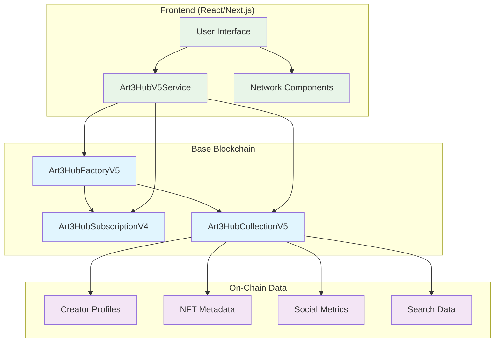

# Art3Hub V5 - Base-Only Architecture with Enhanced On-Chain Data Storage

> **⚠️ DEPRECATED**: V5 has been superseded by **Art3Hub V6** with Firebase integration and fresh smart contracts. This document remains for historical reference.

## 🎯 Overview

Art3Hub V5 represented a paradigm shift in our NFT platform architecture, moving from a multi-network approach to a **Base-only deployment** with comprehensive **on-chain data storage**. This version dramatically reduced database dependencies while providing enhanced features for creators and collectors.

**Migration Notice**: V5 has been fully migrated to V6 which includes:
- Complete Firebase integration replacing on-chain data storage
- Fresh V6 smart contract deployment
- Enhanced admin management system
- Improved AI agent capabilities
- Advanced claimable NFT system

## 🔵 Base-Only Architecture

### Why Base?
- **Low Transaction Costs**: Affordable gas fees enable rich on-chain features
- **High Performance**: Fast transaction processing and confirmation times
- **Growing Ecosystem**: Vibrant DeFi and NFT ecosystem with strong adoption
- **Coinbase Integration**: Direct integration with Coinbase wallet and ecosystem
- **Developer-Friendly**: Excellent tooling and documentation

### Network Focus
- **Base Mainnet**: Production deployment for live users
- **Base Sepolia**: Testnet for development and testing
- **Unified Experience**: Consistent performance across environments

## 🏗️ V5 System Architecture



## 📊 Enhanced Data Storage

### Creator Profiles (On-Chain)
```typescript
interface CreatorProfile {
  name: string                    // Display name
  username: string               // Unique username
  email: string                  // Contact email (optional)
  profilePicture: string         // IPFS hash
  bannerImage: string           // IPFS hash
  socialLinks: string           // JSON: Instagram, X, Farcaster
  isVerified: boolean           // Platform verification
  profileCompleteness: number   // 0-100% completion
  createdAt: Date
  updatedAt: Date
}
```

### NFT Extended Metadata (On-Chain)
```typescript
interface NFTExtendedData {
  category: string              // "Digital Art", "Photography", etc.
  tags: string[]               // ["abstract", "colorful", "modern"]
  ipfsImageHash: string        // Direct IPFS image access
  ipfsMetadataHash: string     // Complete metadata on IPFS
  createdTimestamp: Date
  royaltyBPS: number          // Per-NFT royalty settings
  isVisible: boolean          // Privacy control
  isFeatured: boolean         // Creator highlighting
  additionalMetadata: string  // JSON for future extensions
}
```

### Social Features (On-Chain)
```typescript
interface NFTStats {
  totalViews: number           // View count
  totalLikes: number          // Like count
  totalShares: number         // Share count
  averageRating: number       // 1-5 stars (×100 for decimals)
  ratingCount: number         // Number of ratings
  lastUpdated: Date
}
```

## 🔍 Advanced Search & Discovery

### Category-Based Discovery
- **Predefined Categories**: Digital Art, Photography, Music, Gaming, Collectibles
- **Dynamic Categories**: Community-driven category creation
- **Cross-Collection Search**: Find NFTs across all collections in a category

### Tag-Based System
- **Multi-Tag Support**: NFTs can have multiple descriptive tags
- **Tag Analytics**: Popular tags and trending content
- **Tag Combinations**: Filter by multiple tags simultaneously

### Creator-Centric Discovery
- **Creator Profiles**: Rich on-chain profiles with social verification
- **Featured Content**: Creators can highlight their best work
- **Creator Collections**: Easy discovery of all works by an artist

### Social Metrics
- **Popularity Sorting**: Sort by views, likes, and ratings
- **Engagement Analytics**: Track community interaction
- **Trending Content**: Discover popular and emerging works

## 🎨 V5 Smart Contracts

### Art3HubFactoryV5
**Enhanced factory with comprehensive discovery features**

Key Functions:
- `createCollectionV5()`: Create collections with creator profile integration
- `mintNFTV5()`: Mint NFTs with extended metadata
- `searchCollections()`: Advanced collection search with filters
- `getCollectionsByCategory()`: Category-based collection discovery
- `getPlatformStats()`: Platform-wide analytics

Features:
- Gasless collection creation and minting
- Enhanced voucher system with creator data
- Platform-wide category and tag management
- Advanced search and filtering capabilities

### Art3HubCollectionV5
**Feature-rich NFT collection with on-chain data**

Key Functions:
- `createCreatorProfile()`: Establish on-chain creator presence
- `setNFTExtendedData()`: Rich metadata for each NFT
- `likeNFT()` / `rateNFT()`: Social interaction features
- `searchNFTs()`: Collection-specific search
- `getFeaturedNFTs()`: Highlighted creator content

Features:
- Complete creator profile management
- NFT social interaction tracking
- Advanced metadata storage
- Privacy and visibility controls
- Featured content management

### Art3HubSubscriptionV4 (Reused)
**Proven subscription system with gasless upgrades**

Plans:
- **FREE**: 1 NFT/month, auto-enrollment
- **MASTER**: 10 NFTs/month, $4.99 USDC
- **ELITE**: 25 NFTs/month, $9.99 USDC

Features:
- Gasless subscription upgrades
- USDC-based payments
- Automatic quota management
- Integration with V5 contracts

## 🔧 Art3HubV5Service

### Contract-Based Data Reading
```typescript
class Art3HubV5Service {
  // Creator profile management
  async getCreatorProfile(address: Address): Promise<CreatorProfile>
  async getCreatorByUsername(username: string): Promise<Address>
  
  // NFT data access
  async getNFTFullData(tokenId: number): Promise<NFTFullData>
  async getCreatorNFTs(creator: Address): Promise<number[]>
  async getFeaturedNFTs(creator: Address): Promise<number[]>
  
  // Search and discovery
  async searchNFTs(filters: SearchFilters): Promise<number[]>
  async searchCollections(filters: SearchFilters): Promise<Address[]>
  async getNFTsByCategory(category: string): Promise<number[]>
  async getNFTsByTag(tag: string): Promise<number[]>
  
  // Analytics
  async getPlatformStats(): Promise<PlatformStats>
  async getCollectionOverview(address: Address): Promise<CollectionInfo>
}
```

### Database Minimization Benefits
- **Real-Time Data**: Always current blockchain data
- **Reduced Infrastructure**: Minimal server requirements
- **Improved Reliability**: No database synchronization issues
- **Enhanced Security**: Immutable, verifiable data
- **Cost Optimization**: Reduced operational expenses

## 🎯 Migration Strategy

### Phase 1: Frontend Base-Only Focus ✅
- Updated NetworkSelector for Base-only display
- Modified network configuration to prioritize Base
- Hidden multi-network complexity from users

### Phase 2: Enhanced Smart Contracts ✅
- Created Art3HubCollectionV5 with on-chain data storage
- Built Art3HubFactoryV5 with advanced discovery features
- Implemented comprehensive voucher system

### Phase 3: Service Layer Development ✅
- Built Art3HubV5Service for contract-based data reading
- Implemented comprehensive data access patterns
- Created search and discovery APIs

### Phase 4: Frontend Integration 🚧
- Update components to use V5 service
- Implement on-chain profile management
- Add advanced search and filtering UI
- Integrate social features

## 🚀 Deployment Process

### Prerequisites
```bash
# Install dependencies
npm install

# Configure environment
cp .env.example .env
# Add your PRIVATE_KEY and API keys
```

### Deploy to Base Sepolia (Testnet)
```bash
npm run deploy:v5:baseSepolia
```

### Deploy to Base Mainnet
```bash
npm run deploy:v5:base
```

### Post-Deployment
1. Update frontend environment variables
2. Verify contracts on Base Explorer
3. Test all V5 functionality
4. Monitor gas usage and performance

## 📈 Performance Benefits

### Gas Optimization
- **Efficient Data Structures**: Optimized storage layouts
- **Batch Operations**: Multiple actions in single transaction
- **Smart Caching**: Reduced redundant reads
- **Base Network**: Low gas costs enable rich features

### User Experience
- **Faster Loading**: Direct blockchain reads
- **Real-Time Updates**: No database lag
- **Enhanced Features**: Rich on-chain profiles and social features
- **Simplified Architecture**: Reduced points of failure

### Developer Experience
- **Simplified APIs**: Direct contract interaction
- **Type Safety**: Strong TypeScript integration
- **Better Testing**: Blockchain-based testing
- **Reduced Complexity**: Fewer moving parts

## 🔒 Security & Privacy

### Smart Contract Security
- OpenZeppelin standards for proven security
- Comprehensive access controls
- Reentrancy protection
- Input validation and sanitization

### Data Privacy
- Optional email storage with user consent
- Profile visibility controls
- NFT privacy settings
- GDPR-compliant data handling

### Decentralization Benefits
- Reduced reliance on centralized databases
- Immutable audit trails
- Transparent operations
- Community verifiable data

## 🌟 V5 Feature Highlights

### For Creators
- **Rich Profiles**: Comprehensive on-chain presence
- **Social Verification**: Platform verification system
- **Advanced Analytics**: Deep insights into audience engagement
- **Featured Content**: Highlight your best work
- **Flexible Privacy**: Control visibility of your content

### For Collectors
- **Enhanced Discovery**: Find NFTs through multiple discovery paths
- **Social Features**: Like, rate, and share favorite pieces
- **Creator Following**: Track your favorite artists
- **Advanced Search**: Filter by category, tags, popularity, and more
- **Real-Time Data**: Always current information

### For Developers
- **Simplified Integration**: Direct contract interaction
- **Rich APIs**: Comprehensive data access patterns
- **Type Safety**: Full TypeScript support
- **Better Testing**: Blockchain-native testing approaches
- **Documentation**: Comprehensive guides and examples

## 📊 Network Comparison

| Feature | V4 (Multi-Network) | V5 (Base-Only) |
|---------|-------------------|----------------|
| **Networks** | Base, Zora, Celo | Base Only |
| **Data Storage** | Database + Basic On-Chain | Enhanced On-Chain |
| **Creator Profiles** | Database | On-Chain |
| **Social Features** | Limited | Full On-Chain |
| **Search** | Database-based | Contract-based |
| **Deployment Complexity** | High | Low |
| **Maintenance** | Multiple networks | Single network |
| **Gas Costs** | Variable | Optimized for Base |
| **User Experience** | Complex network switching | Simplified Base experience |

## 🔮 Future Roadmap

### V5.1 Planned Features
- **Advanced Creator Tools**: Portfolio management and analytics
- **Community Features**: Comments and discussions
- **Enhanced Social**: Following, notifications, and feeds
- **Creator Monetization**: Direct tips and commissions

### V5.2 Planned Features
- **Mobile App Integration**: Native mobile experience
- **API Ecosystem**: Third-party developer tools
- **Cross-Platform Integration**: Integration with other Base protocols
- **Advanced Analytics**: Machine learning insights

## 📞 Resources & Support

### Documentation
- [Deployment Guide](./ArtHubContract/DEPLOY_V5.md)
- [Smart Contract Reference](./ArtHubContract/contracts/)
- [Service Integration Guide](./ArtHubApp/lib/services/)

### Network Resources
- **Base Mainnet**: https://basescan.org/
- **Base Sepolia**: https://sepolia.basescan.org/
- **Base Documentation**: https://docs.base.org/

### Community
- **GitHub**: Report issues and contribute
- **Discord**: Community support and discussions
- **Twitter**: Latest updates and announcements

---

**Art3Hub V5** - Empowering creators with Base-native, on-chain data storage and enhanced discovery features. 🎨✨